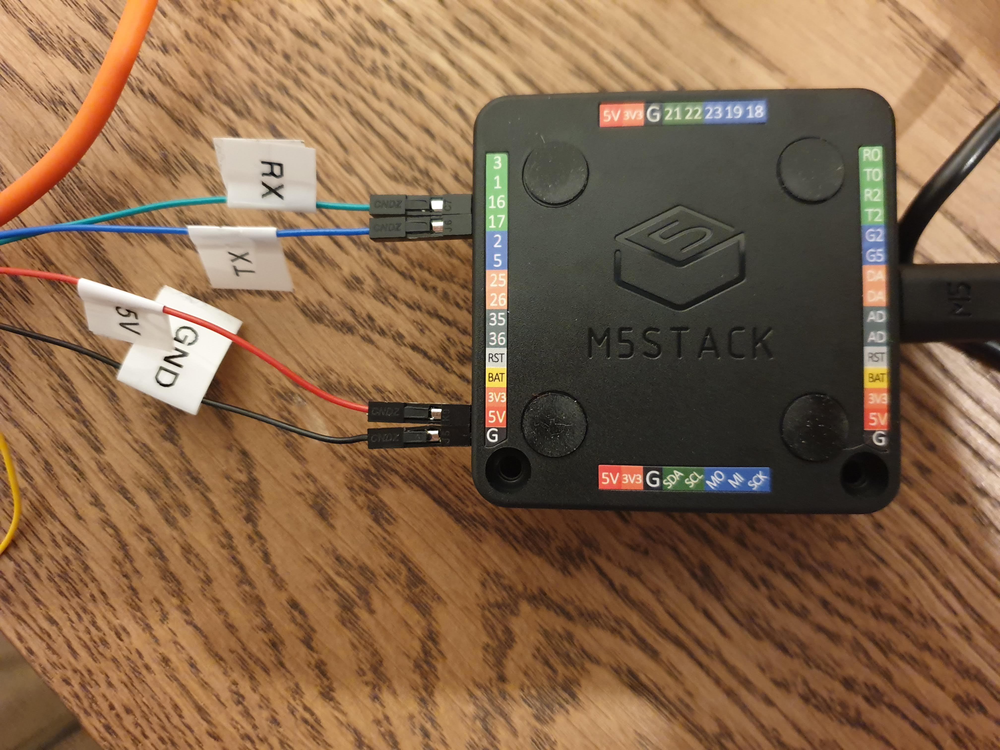

# CO2 ESP32 AWS IoT Device
A play/POC repository resulting from a thread of curiosity during the winter holidays about ESP32, C++ programming, and AWS IoT devices.  Based on [AWS's ESP32 IoT blog post](https://aws.amazon.com/blogs/compute/building-an-aws-iot-core-device-using-aws-serverless-and-an-esp32/), and heavily modified. This project contains:
* Terraform to create AWS IoT components (`./infrastructure`) and an AWS S3 bucket to collect the data
* Code to load on the ESP32 (`./device/app`) which:
  * Sets the current time
  * Reads from Sensor
  * Constructs message of:
    * ```json
      {
         "epoch_time": <int: the Epoch time>,
         "co2_ppm": <int: the CO2 PPM reading>,
         "device_id": <string: the AWS Thing Name>
      }
* Data (for external configuration of certificates, keys, and config) to load on the ESP32 (`./device/app/data`) - this is autogenerated by (`./generate-config.sh`)

## Prerequisites
* [Terraform (v1.1.2)](https://learn.hashicorp.com/tutorials/terraform/install-cli)
* [Arduino IDE](https://www.arduino.cc/en/software)
* An ESP32 device (I have an M5 Stack)
* CO2 Sensor (I have a MH-Z19B)

## Quickstart
1. Connect ESP32 and Sensor

2. [Setup AWS CLI credentials](https://docs.aws.amazon.com/cli/latest/userguide/cli-chap-configure.html) for the default profile
3. `cd infrastructure && terraform init`
4. `cd infrastructure && terraform apply`
5. [Set up Arduino IDE](#set-up-arduino-ide)
6. [Install ESP32 Arduino File Uploader](#install-esp32-arduino-file-uploader)
7. Go to: **Tools** > **Boards** > **Boards Manager**. Find and select ESP32 and your appropriate board.
8. Open Sketch `app.ino` under `device/app`
9. In Terminal, run `~/generate-config.sh` to generate the device config / certificates (it will prompt for your Wifi Ssid / Password). NOTE: you must have a valid AWS session.
10. Upload data **Tools** > **ESP32 Sketch Data Upload**
11. Compile code and flash device (`command + u`)

## Set up Arduino IDE
1. [Download the Arduino installer](https://www.arduino.cc/en/software) for your operating system.
2. Start the Arduino IDE
3. Under **Preferences** > **Settings** > **Additional Board Manager URLs**, add `https://dl.espressif.com/dl/package_esp32_index.json`
4. **Tools** > **Board** > **Boards Manager**, search for `esp32` and install the latest version.
5. Under Sketch > Include Library > Manage Libraries, install the following:
   1. MQTT (latest version by Joel Gaehwiler)
   2. ArduinoJson

## Install ESP32 Arduino File Uploader
1. Find the latest release of the [File Uploader](https://github.com/me-no-dev/arduino-esp32fs-plugin/releases/) and download the `.zip`
2. Create a directory in the Ardunio IDE called `tools`. On a mac: `mkdir ~/Documents/Arduino/tools`
3. Unzip the file uploader into the new tools directory. Location (mac): `~/Documents/Arduino/tools/ESP32FS/tool/esp32fs.jar`.
4. Restart Arduino IDE
5. There should now be a **Tools** > **ESP32 Sketch Data Upload** option which can be run on-demand
6. All files to be uploaded should be placed at `app/data`

## References
### Reading from the CO2 Sensor
* [Reading values from a CO2 Sensor](https://forum.arduino.cc/t/problem-with-co2-sensor-mh-z19b-cannot-read-values/504873/6#msg3587557)
* [Full example](https://github.com/tobiasschuerg/MH-Z-CO2-Sensors/blob/4e868c9cee8a86066a1287c9f2b46fee7e293e93/MHZ.cpp)
* [How to use Serial2](https://github.com/G6EJD/ESP32-Using-Hardware-Serial-Ports/blob/master/ESP32_Using_Serial2.ino)

### Helpful libraries
* [HardwareSerial.cpp](https://github.com/espressif/arduino-esp32/blob/108e46716461b84fbb53814e45dc18a19a79fcdd/cores/esp32/HardwareSerial.cpp)
* [Using HardwareSerial to send/receive strings over serial](https://www.esp32.com/viewtopic.php?t=10300)

### Loading Files onto the Device
* [...for an ESP8266](https://github.com/esp8266/Arduino/issues/2470)
* [Loading files on an ESP32 using SPIFFS](https://randomnerdtutorials.com/esp32-vs-code-platformio-spiffs/)
* [SPIFFS and JSON to save configurations on an ESP8266](https://www.youtube.com/watch?v=jIOTzaeh7fs)

### Can I do this in Python?
* [Installing Micropython](https://docs.micropython.org/en/latest/esp32/quickref.html#installing-micropython)

## Troubleshooting
### Can't upload data to device because "device is busy"
Because this device runs infinitely, the ports are "busy". What's worked for me is unplugging the device from my USB port, closing Arduino IDE, opening Arduino IDE, plugging the device back in, and then attempting to do the data upload. Afterwards, compile and flash the device as you usually do.

### X509 - Certificate verification failed, e.g. CRL, CA or signature check failed
I had this error when setting up the MQTT client. Recheck that all of the certificates are correct (Amazon RootCA1, Device Certificate, Device Private Key). It turns out that the `aws_iot_endpoint` that you get back from terraform looks something like `xxxxxx.iot.REGION.amazonaws.com` and is missing an `-ats` (required: `xxxxxx-ats.iot.REGION.amazonaws.com`).

### It's all broken
Yes, this repo could benefit from some TDD. Next holiday, I get to delete it all and rewrite it with tests.

## Ideas for development
* Handle Wifi not available
  * Don't infinitely check for wifi, maybe backoff
  * Handle data collected during wifi outages
* Better logging for debug mode
* OTA